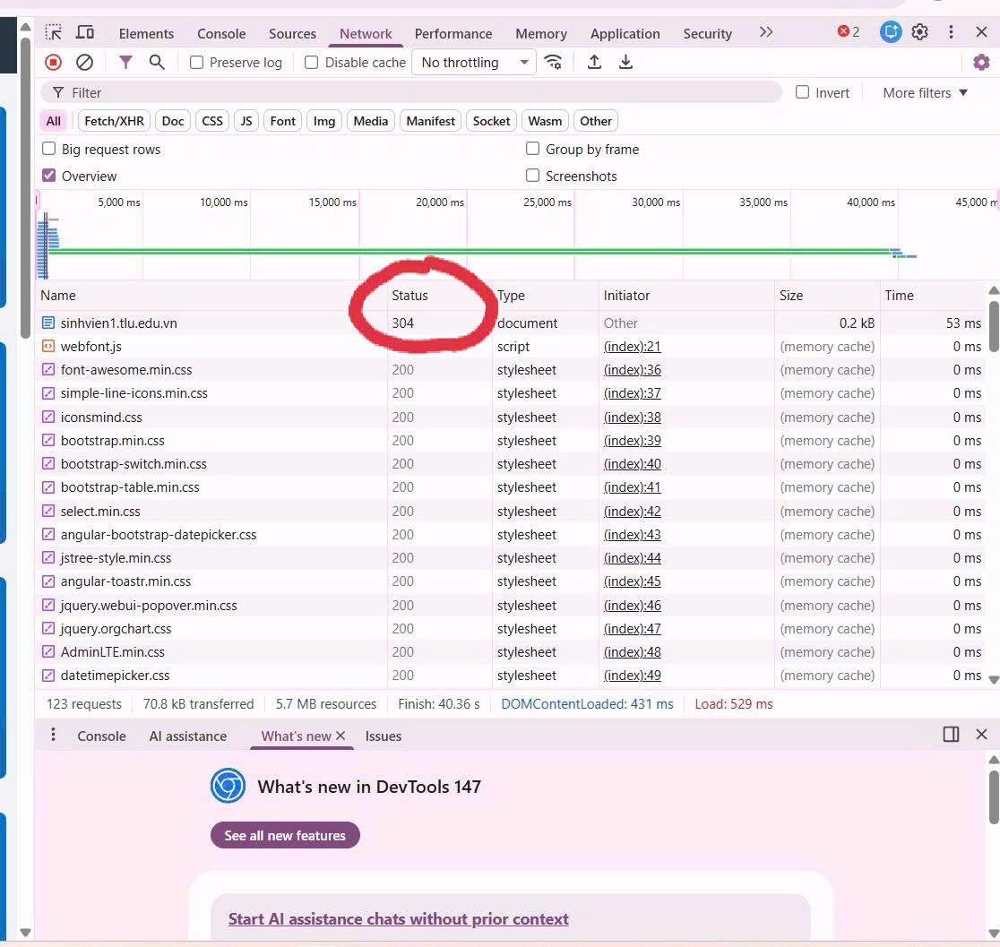
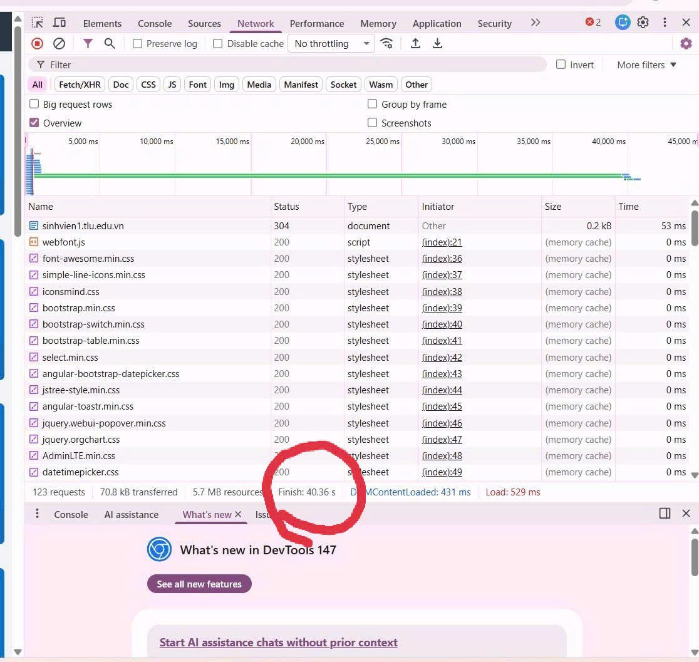
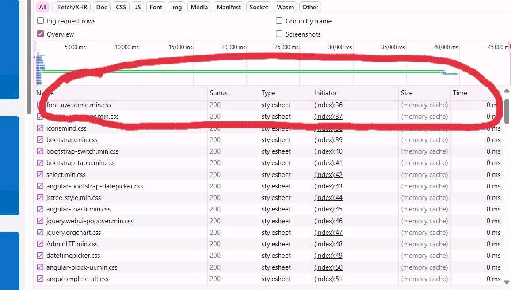
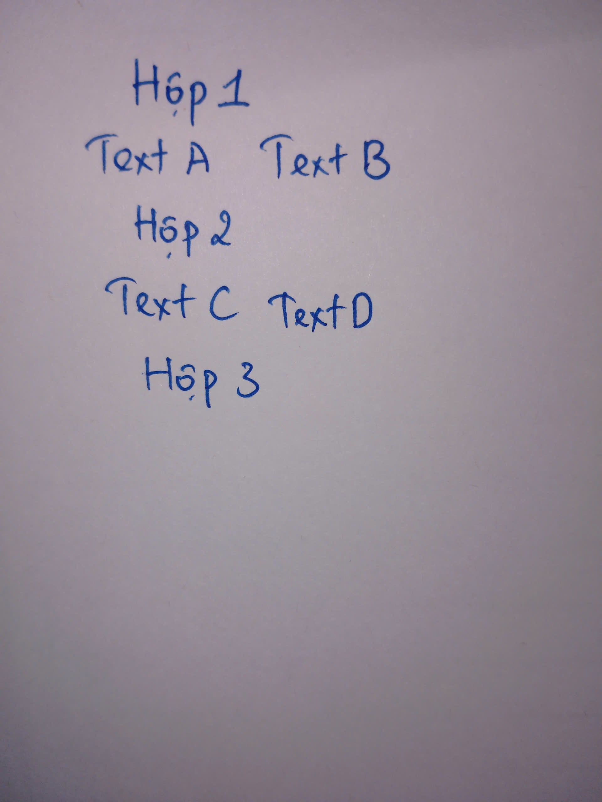

# Câu A1 (5đ) — HTTP & Browser (answers.md - Phần A)

## 1. Khi bạn gõ https://shopee.vn vào trình duyệt và nhấn Enter, hãy liệt kê đúng thứ tự ít nhất 5 bước xảy ra (từ DNS lookup đến render).

- DNS Lookup
- TCP Connection
- TLS Handshake
- Gửi HTTP Request
- Server xử lý và trả HTTP Response
- Browser parse HTML
- Tải tài nguyên phụ
- Render

## 2. 
### 2.1. Trong DevTools của Chrome, tab Network cho thấy thông tin gì?
Cho thấy thông tin:
- Danh sách các request
- Status
- Time
- Size
- Waterfall

### 2.2.
- Status Code của request đầu tiên
  


- Tổng thời gian load trang



- Một request trả về file CSS



# Câu A2 (5đ) — Semantic HTML (answers.md - Phần A)

- Lỗi:
+ Dùng `<div>` thay vì semantic tags
+ Không có `<header>`, `<nav>`, `<main>`
+ Không dùng `<h1>` cho tiêu đề chính
+ Không dùng `<article>` cho sản phẩm
+ Không có `alt` cho ảnh
- Sửa lại:
```
<header>
    <h1>ShopTLU</h1>
    <nav>
        <a href="/">Trang chủ</a>
        <a href="/products">Sản phẩm</a>
    </nav>
</header>

<main>
    <article>
        <h2>iPhone 16 Pro</h2>
        <p>25.990.000đ</p>
        <figure>
            
        </figure>
    </article>
</main>

<footer>
    <p>© 2026 ShopTLU</p>
</footer>
```

# Câu A3 (5đ) — Block vs Inline (answers.md - Phần A)


Giải thích:
- `<div>` : Là 1 block chiếm 1 dòng riêng
- `<span>`,`<strong>` : Là inline nằm cùng dòng

# Câu A4 (5đ) — Table (answers.md - Phần A)
- Sự khác nhau:
+ `<thead>` : là phần header, chứa tiêu đề
+ `<tbody>` : là phần giữa, chứa dữ liệu
+ `<tfoot>` : là phần dưới, để tổng kết
- KHÔNG NÊN dùng table để tạo layout trang web vì
+ Khả năng truy cập kém
+ Tốc độ tải trang chậm
+ Khó bảo trì và nâng cấp
+ Code rối
-----

# Bài B4 (15đ) — Phân tích trang web thật

## 1

- 3 thẻ semantic HTML5 mà trang đó sử dụng


+ Thẻ `<noscript>`: Thẻ này dùng để hiển thị nội dung thay thế nếu trình duyệt không hỗ trợ hoặc bị tắt JavaScript
+ Thẻ `<script>`: Đây là thẻ để nhúng mã thực thi
+ Thẻ `<div>` : Chứa nội dung chính của trang web

## 2


- Table hiển thị hướng dẫn chọn size quần
- Có dùng `<thead>`,`<tbody>`

## 3

- `action`: `/search`
- `method`: `get`
- `input types`: `type="button"`